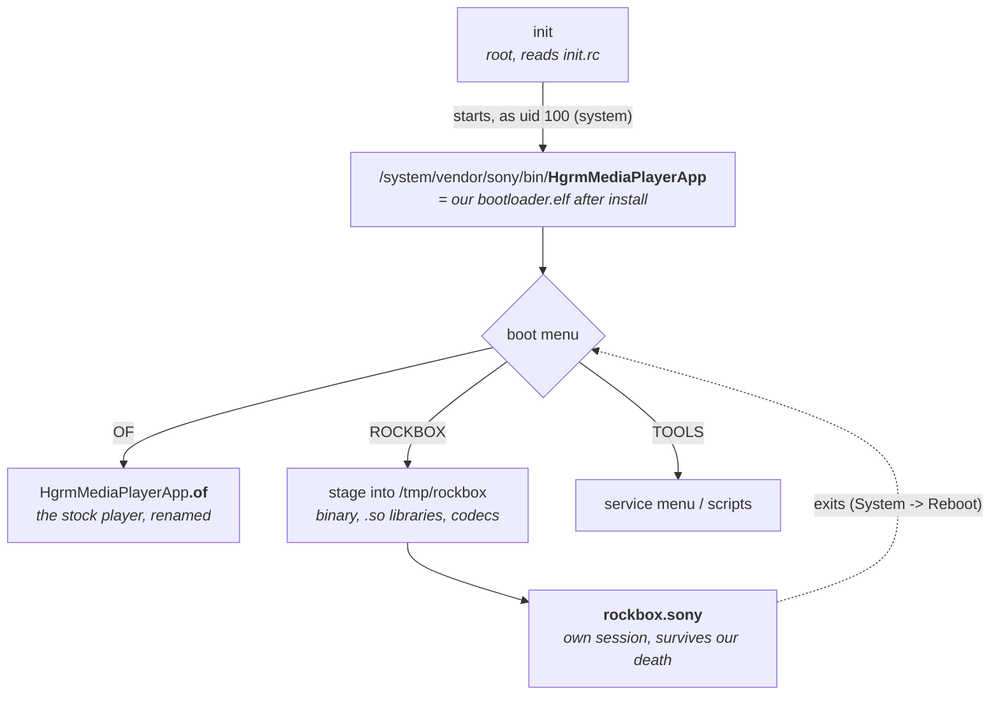
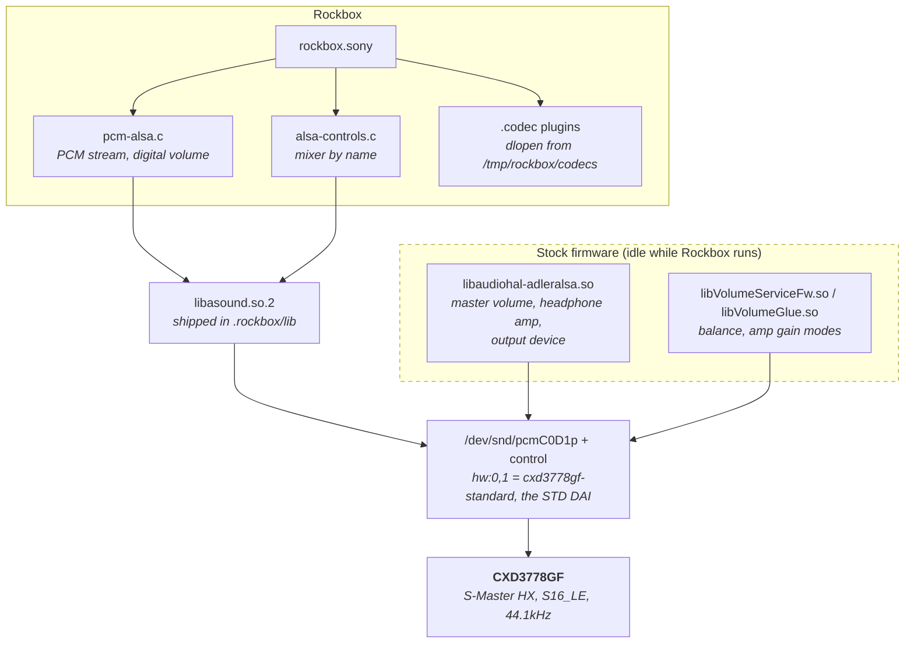
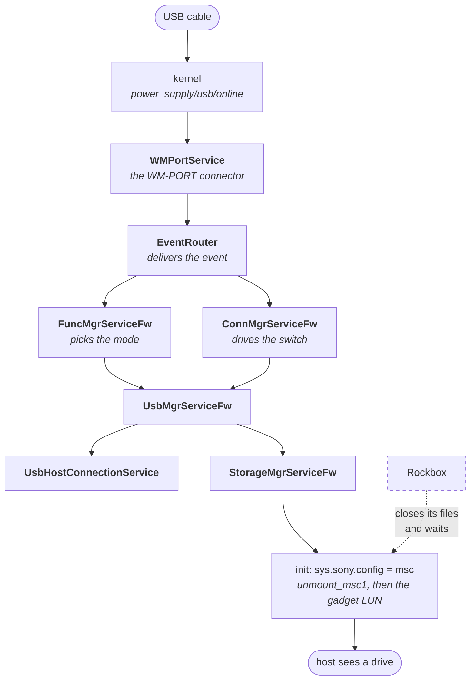
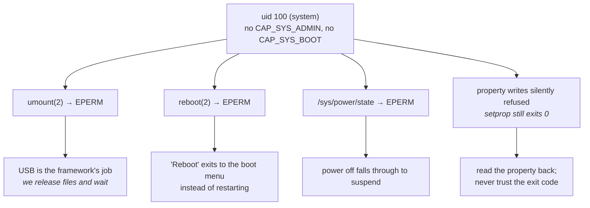
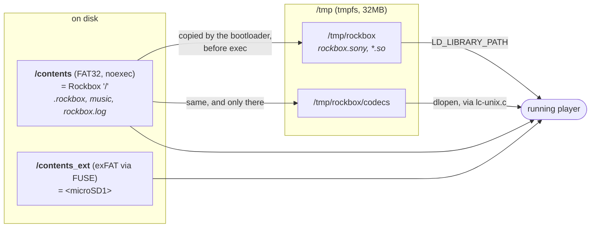

# Rockbox on the Sony NW-A30 (unofficial)

A work-in-progress Rockbox port to the Sony NW-A30 series (NW-A35/A36/A37),
Sony's "Hagoromo" platform: a MediaTek MT8127 running Linux 3.10 with a
hard-float glibc userspace.

This is **not** an official Rockbox port and is not submitted for inclusion
upstream. It is a fork of Rockbox with a new target added; everything outside
the NW-A30 target is upstream Rockbox, under its own licence (GPLv2).

## Provenance

The NW-A30 target here was written with heavy use of an AI assistant (Claude).
The upstream project asks that AI-generated contributions be explainable line by
line and does not generally accept them, which is why this lives in its own
repository rather than as a pull request. If any of it is ever useful upstream,
it should be reworked and defended by a person who understands it, not
submitted as-is.

## State

Working on the device:

- boots and runs for hours from the user partition, replacing the stock
  application
- 480x800 display at 32bpp, backlight control
- all buttons (rew, ff, play/pause, volume, power) and the hold switch
- touchscreen, calibrated
- audio playback, with the volume set on the codec rather than in software
- the memory card, as a second volume
- USB mass storage while Rockbox is running
- battery level from the kernel's power supply class
- Japanese text, from a font generated for this port

Not working yet:

- **output is roughly 10 dB quieter than the stock firmware** at the same codec
  volume. The stock player's 35/120 sounds like our 120/120, and we do reach
  the top of `master volume`, so the loss is ahead of it.
- **Bluetooth.** Audio goes out through Sony's own stack, which is not something
  Rockbox has a counterpart for. Use the stock firmware for that.
- **Plugins are not built** (`plugins=""`): most have no keymap for this pad and
  stop the build. `db_folder_select.rock` being absent is the visible one.
- **FM radio**: the tuner is a different part (`radio_si4708icx`) that does not
  answer the ioctls the existing driver sends, so it is left out.
- **Real power off and reboot are impossible.** Both need capabilities we do not
  have; see "What we are allowed to do" below.

## Taking a screenshot

Hold **both volume keys** together. The picture goes to `dump_0001.bmp` at the
root of the user partition, next to `rockbox.log`, so it is there the next time
the player is plugged in.

Rockbox's own screenshot mechanism - the debug menu's "Screendump", which arms a
dump for the next USB insertion - is compiled out of `APPLICATION` builds, and a
cable is the one thing this player cannot spare: it is a request to the stock
framework to take the user partition away.

## How it fits together

### Who runs what

The dualboot installer renames the stock application and takes its place, so
init starts our bootloader believing it is starting the player. The bootloader
copies Rockbox somewhere it can be executed from, starts it in a session of its
own, and waits.

Rockbox outlives the bootloader on purpose. The stock userspace kills the
application in that slot about half a minute in, and restarts it - which is our
bootloader again, so it checks for a Rockbox that is already running and stands
aside rather than starting a second one.

The first thing Rockbox itself draws is the logo, with the commit it was built
from underneath - the middle player at the top of this page. That line is worth
reading before drawing any conclusion from a test: a stale build looks exactly
like a broken one, and this port lost whole evenings to that.

### What Rockbox links, and what it steps around

The stock player reaches the same codec through Sony's own HAL. We do not use
any of it; we open ALSA directly and drive the mixer ourselves. The two columns
below never meet at runtime, because the stock player is not running when
Rockbox is.

`hw:0,1` is the only device on the codec's "STD" DAI; the other five are Sony's
own "ICX" paths. It takes `S16_LE` and nothing else, and it really runs at
44.1kHz - it accepts other rates without complaint but the clock does not
follow, so a 96kHz track played at 0.46x until the target claimed only what the
hardware does.

### The Sony daemons

Every one of Sony's daemons is a `hagodaemon` process carrying `libpstcore.so`,
which watches the foreground application and restarts the machine when it
decides one is stuck - as it would for us, since we do not speak the IPC it
waits on. So Rockbox freezes them with `SIGSTOP` at startup and `SIGCONT`s them
on the way out.

Freezing all of them stops the restarts but also takes USB with it, because the
chain that carries a cable insertion runs through them. These stay awake:

Rockbox does not touch any of it. It cannot: `sys.sony.config` and `ctl.start`
are both refused for uid `system`, and `init.svc.unmount_msc1` reads back empty,
proving init never ran the service on our behalf. Writing to the gadget anyway
is what produced the long-standing symptom of a first cable that worked and a
second that came up empty - our writes left the framework's state machine out of
step with itself. All Rockbox owes it is to stop using the disk.

Two daemons are treated specially, in the other direction:

| daemon | what happens | why |
| --- | --- | --- |
| `appmgrservice` | frozen | it runs the timeout that restarts the machine when the home application never reaches the foreground |
| `PathMgrServiceFw` | frozen, and **must stay** frozen | sparing it makes the machine restart |
| `icx_bootanimation` | killed | nothing tells the boot splash that boot is over, so it keeps drawing over the screen |

Extra names can be spared without rebuilding by listing them one per line in
`/contents/.rockbox/usb_spare.txt`.

### What we are allowed to do

Rockbox runs as uid 100 (`system`), in group 3003 and nothing else. That single
fact explains most of the shape of this port:

### Where the files live

`/contents` is the user partition Rockbox sees as `/`. It is FAT32 and mounted
**noexec**, which is why nothing can be executed or `dlopen`'d from it.

The codecs have to be staged by the *bootloader* rather than by Rockbox: a
running `rockbox.sony` may create directories under `/tmp/rockbox` but not
files, even in the directory the bootloader wrote the binary into moments
earlier. Loading an already-staged library works, so what is denied is file
creation, not dynamic loading.

The database needs the card named explicitly - `DEFAULT_TAGCACHE_SCAN_PATHS` is
`/<microSD1>:/`, card first - because tagcache drops a search root that lies
inside one it already holds, and a root of `/` is one character long, so it
swallows every later path. The card is not inside `/` here at all.

## Building

The toolchain is a hard-float ARMv7 one, which upstream `rockboxdev.sh` does not
build by default - the target added here (`--target=h`) does. A Docker recipe
that builds both it and the port is in `tools/docker_nwa30/`.

    docker build -f tools/docker_nwa30/Dockerfile.hf -t rockbox-nwa30:hf .
    mkdir -p build/nwa30 && cd build/nwa30
    ../../tools/configure --target=235 --type=n && make && make zip

**The device must get a hard-float binary.** A soft-float one does not exec at
all, and the failure looks exactly like a boot loop with an empty log, because
the application dies before it can open one. `readelf -l` before flashing.

The player needs `libasound.so.2` and the bootloader font shipped alongside the
binary in `.rockbox/`, since neither can be relied on to exist on the device.

Rockbox ships no CJK font above 16px, so this port generates its own:

    utils/nwztools/scripts/make_cjk_font.py \
        NotoSansJP.ttf 35 fonts/35-Noto-Sans-CJK-JP.bdf Regular

It cuts Noto Sans JP down to JIS X 0208 - kana, punctuation and the level 1+2
kanji, about 7000 glyphs - which keeps everyday Japanese readable without the
tens of megabytes the full repertoire would cost.

## Installing

`utils/nwztools/scripts/` has the firmware upgrade packages: `recon_hagoromo.sh`
dumps information about the device without changing it,
`install_dualboot_hagoromo.sh` installs the bootloader, and
`uninstall_dualboot_hagoromo.sh` puts the stock application back. Flashing needs
a Linux or Windows machine - `scsitool` has no macOS backend, and the official
macOS updater's kext is Intel-only.

**The stock application is renamed rather than deleted**, so the uninstall
package restores it; Sony's own firmware updater also restores everything.
